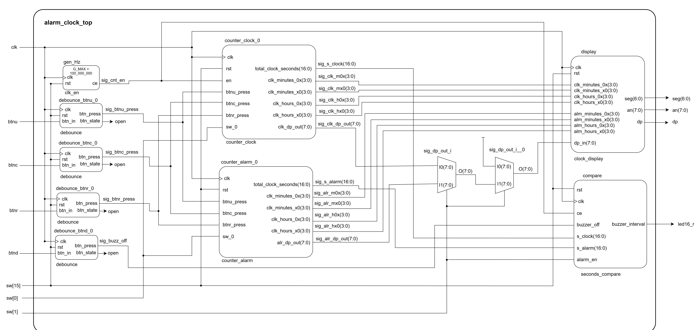
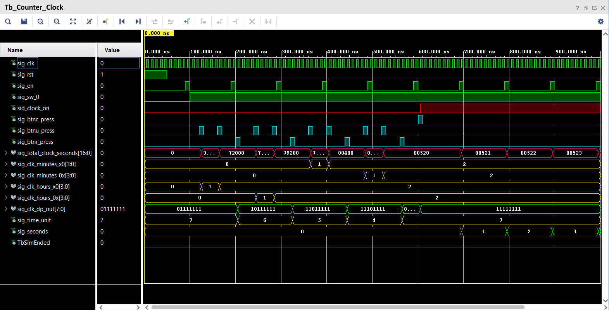
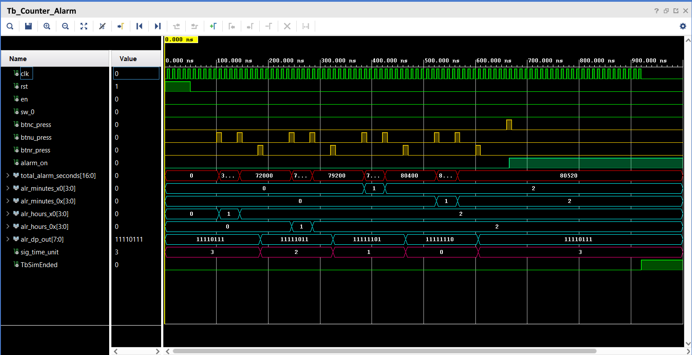
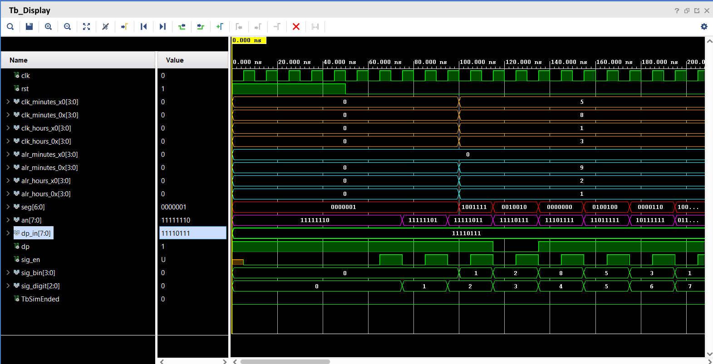
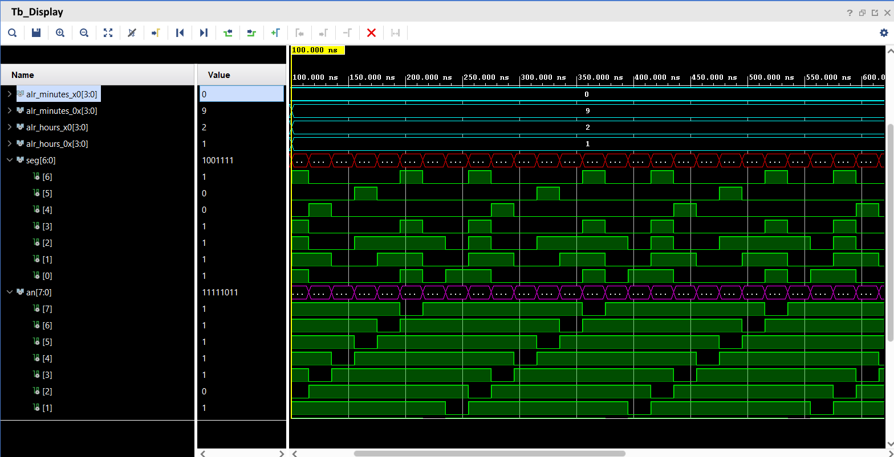
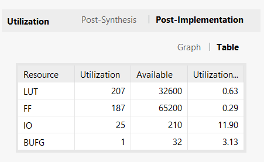

# DE1-project
Alarm_Clock - Projekt z předmětu DE1, tým Bagačka, Focher a Langová

-----------------------------------------------------------------------------------------------------------------------------------------------------------------------------

<!-- 
Cv. 1.:
Obr. 1: Prvotní verze blokového schéma pro Alarm Clock

Obr. 2: Aktualizované schéma pro Alarm Clock
 -->

<!--
Princip či premise:
- Principální rozděleni Nexys A7 50T segmentovek na 2 části: 1. část, tedy an[3->0], zobrazuje Clock a 2. část (an[7->4]) zobrazuje Alarm. 

Clock
- counter_clock = čítač clk s vystupy "seconds" (odpovídá sig_cnt, naše základní jednotka pro porovnávání v modulu Compare a pro převody na vyšší jednotky času)
"minutes" (převod sig_cnt (seconds) na uběhlé minuty pro zobrazení na anodách, vypočet přes MODulo a dělení 60 atd.)
"hours" (převod sig_cnt (seconds) na uběhlé hodiny pro zobrazení na anodách, vypočet přes MODulo a dělení 60 atd.)
G_max na 24•60•60 = 86400, tedy počet sekund v jednom dni (24 hodin)

Alarm
- podobný princip jako clock ale s důležitým nastavením hodin a minut pro spouštění budíku, při porovnání s aktualním časem Clocku
vychozí zase "seconds", "minutes" a "hours", sekundy pro porovnání, minuty a hodiny na zobrazeni 
myšlenka: "uživatel si tlačítky asi BTNU, BTNR a BTNC zvolí čas k spuštění budíku, volí si hodiny a minuty, ty se převedou zpět na sekundy a vyvodí "seconds"  pro porovnání,
BTNC asi pro potvrzení a spuštění, čítač zde spíše funguje pro synchronizaci s Clockem"

Compare
- modul porovnávající počet uběhlých sekund z Clocku s počtem sekund na Alarmu (budíku), sc == sd a ještě podmínka, výchozím bude signál s frekvencí pro modul buzzeru

Buzzer
- deska má vástup typu mono audio output, tedy buď zkusíme připojit na jednoduchý reproduktor a vytvoříme modul pro zvukovou signalizaci,
a nebo, což se jeví ve fázi simulaci a vytváření přijatelnější, světelná signalizace RGB LEDky za stanovené frekvence  -->

-----------------------------------------------------------------------------------------------------------------------------------------------------------------------------

## Obecný popis
Projekt má realizovat Budík (=Alarm Clock), s funkcionalitami:
1.	Nastaviení a odpočítávání ubíhající čas - realizovano pomocí modulu counter_clock
2.	Nastavení času budíku, při kterém se aktivuje signalizace - realizovano pomocí modulů counter_alarm a compare_seconds
3.	Zobrazení obou časů – realizováno pomocí clock_display. Čas je zobrazován ve 24 hodinovém formátu ve tvaru Hodiny:Minuty.

7-segmentové displeje jsou využity následovně: 1. část, tedy an[3->0], zobrazuje čas hodin (counter_clock) a 2. část (an[7->4]) zobrazuje budík( counter_alarm). 

Nastavování času se provádí pomocí tlačítek BTNU, BTNR a spínače SW[0] (blíže popsané v Ovládání).
Signalizace je realizovaná pomocí RGB LED. Ovládá se pomocí SW[1] a BTND.

## Schéma zapojení:

<!-- potřeba doplnit popisy jednotlivých komponent -->

## Popis jednotlivých komponent

### Debouncer
&nbsp;&nbsp;&nbsp;&nbsp;Komponenta ze cvičení, ošetřuje vstupy z tlačítek.
### Clk_en
&nbsp;&nbsp;&nbsp;&nbsp;Komponenta ze cvičení, generuje signál s periodou 1s, slouží jako základ pro odpočítávání času. G_MAX je nastaveno na 100_000_000.
### Counter_clock 
#### p_clock_startstop
&nbsp;&nbsp;&nbsp;&nbsp;Proces reaguje na stisknutí tlačítka BTNC, kterým mění hodnotu sig_clock_on určující jestli hodiny ubíhají nebo ne(=nastavuje se čas).
#### p_time_unit_edit
&nbsp;&nbsp;&nbsp;&nbsp;Proces reaguje na stisk tlačítka btnr, počítá stisknutí (sig_time_unit) a posouvá nastavovaný řád od minut na hodiny
#### p_clock_setting
&nbsp;&nbsp;&nbsp;&nbsp;Proces zajišťuje jak ošetření nastavování řádu jednotlivých digit tak přičítání sekund k aktuánímu času při běhu hodin.

&nbsp;&nbsp;&nbsp;&nbsp;Výstupem jsou "seconds" (odpovídá sig_cnt, naše základní jednotka pro porovnávání v modulu compare a pro převody na vyšší jednotky času), "minutes" (převod sig_cnt (seconds) na uběhlé minuty pro zobrazení na anodách, vypočet přes MODulo a dělení 60 atd.) a "hours" (převod sig_cnt (seconds) na uběhlé hodiny pro zobrazení na anodách, vypočet přes MODulo a dělení 60 atd.)
### Counter_alarm
#### p_time_unit_edit
&nbsp;&nbsp;&nbsp;&nbsp;Funguje stejně jako u counter_clock.
#### p_alarm_setting
&nbsp;&nbsp;&nbsp;&nbsp;Ošetřuje pouze nastavování času ale na rozdíl od stejného procesu v counter_clock nepřičítá sekundy.

&nbsp;&nbsp;&nbsp;&nbsp;Výstupem jsou opět "seconds" pro compare, "minutes" a "hours" pro display. 

<!-- podobný princip jako clock ale s důležitým nastavením hodin a minut pro spouštění budíku, při porovnání s aktualním časem Clocku
vychozí zase "seconds", "minutes" a "hours", sekundy pro porovnání, minuty a hodiny na zobrazeni 
myšlenka: "uživatel si tlačítky asi BTNU, BTNR a BTNC zvolí čas k spuštění budíku, volí si hodiny a minuty, ty se převedou zpět na sekundy a vyvodí "seconds"  pro porovnání,
BTNC asi pro potvrzení a spuštění, čítač zde spíše funguje pro synchronizaci s Clockem" -->

### Seconds_compare
&nbsp;&nbsp;&nbsp;&nbsp;Komponenta porovnává počet uběhlých sekund z counter_clock (hodin) s počtem sekund z counter_alarm (budíku). Při shodě těchto dvou hodnot a nařízení budíku spínačem SW[1] ve stavu '1' se aktivuje blikání RGB LED. Signalizace se vypne pomocí stistku BTND. 
### Display_driver
&nbsp;&nbsp;&nbsp;&nbsp;Datových vstupů pro zobrazení času je 8, jsou 4 to hodnoty času pro jednotlivé digity hodin a stejný počet pro budík. 

&nbsp;&nbsp;&nbsp;&nbsp;Anody an[3->0], zobrazují čas hodin, an[7->4] zobrazují čas nastavený na budíku.

&nbsp;&nbsp;&nbsp;&nbsp;Desetinná tečka v režimu nastavování času zobrazuje právě nastavovonou digitu.

## Seznam vstupů a výstupů
<!--
| Vstup  | Funkce                                                                                                                         |
|--------|--------------------------------------------------------------------------------------------------------------------------------|
| BTNC   | Přepínání mezi režimem nastavování času a odpočítáváním času                                                                   |
| BTNR   | Přepínání mezi nastavovanými řády času                                                                                         |
| BTNU   | Nastavovaní hodnoty na daném řádu                                                                                              |
| BTND   | Vypnutí blikání RGB LED                                                                                                        |
| SW[0]  | Přepínání mezi nastavováním hodin (clock) a budíku(alarm)                                                                      |
| SW[1]  | Nařízení budíku, vypnuté = RGB LED nebude blikat při shodě obou časů, sepnuté - RGB LED bude při shodě nastavených časů blikat |
| SW[15] | Resetování celého systému - vynuluování hodin a budíku                                                                         |

| Výstup | funkce |
|--------|--------|
| an     | anody AN7-0       |
| seg    |  |
| dp     |  Ukazuje nastavovaný řád      |
| led_r  |  Světelná signalizace budíku      |

-->

| Název portu | Vstup/výstup | Typ                          | Funkce                                                                                                                         |
|-------------|--------------|------------------------------|--------------------------------------------------------------------------------------------------------------------------------|
| BTNC        | in           | std_logic                    | Přepínání mezi režimem nastavování času a odpočítáváním času                                                                   |
| BTNR        | in           | std_logic                    | Přepínání mezi nastavovanými řády času                                                                                         |
| BTNU        | in           | std_logic                    | Nastavovaní hodnoty na daném řádu                                                                                              |
| BTND        | in           | std_logic                    | Vypnutí blikání RGB LED                                                                                                        |
| SW[0]       | in           | std_logic                    | Přepínání mezi nastavováním hodin (clock) a budíku(alarm)                                                                      |
| SW[1]       | in           | std_logic                    | Nařízení budíku, vypnuté = RGB LED nebude blikat při shodě obou časů, sepnuté - RGB LED bude při shodě nastavených časů blikat |
| SW[15]      | in           | std_logic                    | Resetování celého systému - vynuluování hodin a budíku                                                                         |
| an          | out          | std_logic_vector(7 downto 0) | anody AN7-0                                                                                                                    |
| seg         | out          | std_logic_vector(7 downto 0) | {a, b - f} low active segmenty                                                                                                 |
| dp          | out          | std_logic_vector(7 downto 0) | Signalizace právě nastavovaného číslice hodin                                                                                  |
| led_r       | out          | std_logic                    | Světelná signalizace budíku                                                                                                    |

## Ovládání 
&nbsp;&nbsp;&nbsp;&nbsp;Po nahrání programu na desku se inicializuje do módu nastavení času, tečka indikuje nastvovanou digitu, což bude vyšší digita hodin. Digitu inkrementujete stisknutím tlačítka "nastavení hodnoty času". Na další digitu se přepnete  pomocí "posunutí řádu". 
&nbsp;&nbsp;&nbsp;&nbsp;Jakmile máte nastaven čas na hodinách, sepnutím SW0 se dostanete na nastavování času na budíku a stejným postupem nastavíte čas. 
&nbsp;&nbsp;&nbsp;&nbsp; Nastavování času se ukončí stiskem BTNC, čímž se zároveň aktivuje odpočítávání času. 
&nbsp;&nbsp;&nbsp;&nbsp;Signalizace se aktivuje nastavení SW[1] na '1'. (SW[0] v '0' čas dál běží a čas na budíku je nastaven, ale nespustí se při shodě časů signalizace). Při shodě časů začne RGB led blikat v 1s intervalu. Blikání se vypíná pomocí stisknutí BTND.
&nbsp;&nbsp;&nbsp;&nbsp;Resetovat lze oba časy, pro reset hodin je potřeba nastavit SW[0] na '0' a následně sepnout a vypnout SW[15], analogicky se vyresetuje i budík, ale SW[0] musí být nastaven na '1'. Pro reset obou časů zároveň je potřeba sepnout SW[15] přehodit SW[0] na opačný stav a vypnout SW[15].

## Simulace nových komponent

<!--
Cv. 2.:
- počátky vytváření modulů a testování něktrých testbenchů

Clk_en
- vytvořen pro čítače atd.

Debouncery
- vytvořeny "debounce_btnu", "debounce_btnr" a "debounce_btnc" pro tlačítka BTNU, BTNR a BTNC.
- vystupující signály se napojí převážně do modulu "counter_alarm" pro nastavení času budíku (Hours:Minutes)

Obr. 2: Zobrazená simulace pro tb_debounce_BTNC, zobrazující stisknutí tlačítka (začatek, konec, výchozí signál)

Counter_Clock
- modul vytvořen, vystupem jsou opravdu uplynulé sekundy(CELKOVÉ sekundy pro compare!!!!!, NE zbytek sekund po přepočtu na minuty), minuty a hodiny
- pro dosavadní testování je zvýšen sekundový čas, sig_en <= '1'; wait for 900 us; -->
  
<!--Obr. 2: Zobrazená simulace pro counter_clock tb_counter_clock, zobrazující uplynulé sekundy, minuty a hodiny
 -->

Obr. 2 Simulace pro [counter_clock](https://github.com/zeTiN123/DE1-project/blob/0af88c7881ef8e046cece8022da9438a2ee9e028/Alarm_Clock/Alarm_Clock.srcs/sources_1/new/counter_clock.vhd) ([tb_counter_clock.vhd](https://github.com/zeTiN123/DE1-project/blob/27c8f5caa9d6c2a3313526d3f618cbb40155fe27/Alarm_Clock/Alarm_Clock.srcs/sim_1/new/tb_counter_clock.vhd)) 

Simulace zobrazuje inkrementaci sig_total_clock_seconds pomocí tlačítka BTNU; přepínání mezi nastavovanými řády pomocí BTNR a spuštění odpočítávání času pomocí BTNC. 

Obr. 3 Simulace pro [counter_alarm](https://github.com/zeTiN123/DE1-project/blob/0af88c7881ef8e046cece8022da9438a2ee9e028/Alarm_Clock/Alarm_Clock.srcs/sources_1/new/counter_alarm.vhd) ([tb_counter_alarm.vhd](https://github.com/zeTiN123/DE1-project/blob/27c8f5caa9d6c2a3313526d3f618cbb40155fe27/Alarm_Clock/Alarm_Clock.srcs/sim_1/new/tb_counter_alarm.vhd))

Simulace zobrazuje inkrementaci sig_total_alarm_seconds pomocí tlačítka BTNU; přepínání mezi nastavovanými řády pomocí BTNR.  

Obr. 4 Simulace pro [seconds_compare](https://github.com/zeTiN123/DE1-project/blob/0af88c7881ef8e046cece8022da9438a2ee9e028/Alarm_Clock/Alarm_Clock.srcs/sources_1/new/seconds_compare.vhd) ([tb_seconds_compare.vhd](https://github.com/zeTiN123/DE1-project/blob/27c8f5caa9d6c2a3313526d3f618cbb40155fe27/Alarm_Clock/Alarm_Clock.srcs/sim_1/new/tb_seconds_compare.vhd))

Simulace ukazuje stav při shodě hodnot s_clock a s_alarm, spuštění sig_buzzer activate, buzzer interval který určuje blikání led a následné vypnutí pomocí BNTD (signál buzzer_off).

Obr. 5 První část simulace pro [clock_display](https://github.com/zeTiN123/DE1-project/blob/0af88c7881ef8e046cece8022da9438a2ee9e028/Alarm_Clock/Alarm_Clock.srcs/sources_1/new/clock_display.vhd) ([tb_clock_display.vhd](https://github.com/zeTiN123/DE1-project/blob/27c8f5caa9d6c2a3313526d3f618cbb40155fe27/Alarm_Clock/Alarm_Clock.srcs/sim_1/new/tb_clock_display.vhd))

Obr. 6 Druhá část simulace pro clock_display ([tb_clock_display.vhd](https://github.com/zeTiN123/DE1-project/blob/27c8f5caa9d6c2a3313526d3f618cbb40155fe27/Alarm_Clock/Alarm_Clock.srcs/sim_1/new/tb_clock_display.vhd))

<!--
Seconds_compare
- vytvořena prvotni verze modulu pro porovnavani sekund z clocku a alarmu, s logickým vystupem 0 či 1 pro aktivaci buzzeru
- compare porovnává, ale signál buzzeru je poslán v přesný okamžik shody -> úprava kódu přes counter, který umožní v Hz intervalech pípání buzzeru dokud není BTNC vypnut  -->

<!--Obr. 3: Odsimulování pro Alarm na 3 sekundách, Clock si postupně dopočítá a při shodě je aktivován buzzer v ustáleném bzučení a dokud není pomocí BTN_ vypnut

Obr. 4: Simulace pro seconds_compare z [tb_seconds_comapre](). 
 -->

<!--
Clock_Display
- upravená komponenta display_driver ze cvičení na jednotku zobrazující vstupní hodiny a minuty podle řádů na displej
- nezapomenout upravit G_max na třeba 100_000 pro plynulé zobrazení (ideálně 1 kHz => 100_000_000/1000 = G_max = 100_000, zhruba 250 FPS)
 -->
<!-- Obr. 5: Simulace pro display_clock () Zobrazení pevně daných hodnot času CLOCKu (čas 13:58) a ALARMu (čas 21:09) do zobrazení na displeji pro an[7 až 0]
 -->
<!--
Counter_Alarm
- vytvořen modul pro synchorní nastavování budíku, !!!!CO UDĚLÁ BUZZER_ON S BUZZER_OFF????
- BTNC -> zapnutí/ vypnutí budíku
- BTNR -> posun v řádech jednotek zprava doprava, přeskok by měl přeskočit
- BTNU -> nastavení hodnoty na dotyčném řádu, pouze zvyšuje a při přeskoku by měla od 0 
 
Obr. 6: Simulace pro komponenty display_clock z [tb_display_top](). Zobrazení nastavování podle tlačítek požadovaného budíku (13:58) a výstup pro displej
-->

-----------------------------------------------------------------------------------------------------------------------------------------------------------------------------

## Využití prostředků
Obr. 7: Graf využití prostředků po implementaci 

## Ostatní výstupy
Plakát : 
[Video](https://youtu.be/YcXsUGh_uIs)

## Zdroje a odkazy

